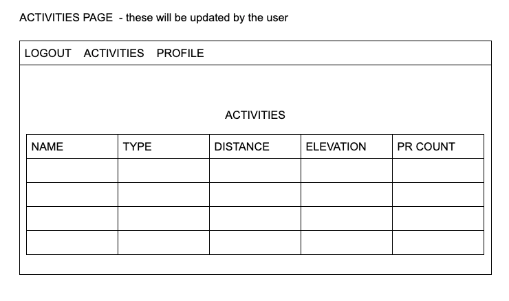
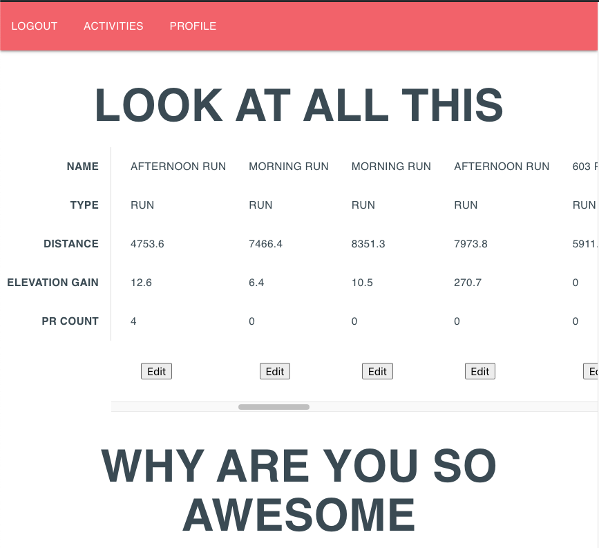

# Be Proud Dashboard

I created this app to gain experience with Oauth authentication. I was able to utilize the Strava API to create a 'yearly roundup' of a Strava users activities. This dashboard is a fun way for me to look back at what I've accomplished for the year. I was inspired by Spotify's yearly promotion. 

## Technologies Used

Express
Node.js
Javascript
HTML & CSS

## User Stories

* As a user, I would like to be able to log in with my Strava credentials
* As a user, I would like to be able to view and update my Strava activity information

### User Model

| Column Name | Data Type | Notes |
| --------------- | ------------- | ------------------------------ |
| id | Integer | Serial Primary Key, Auto-generated |
| name | String | Must be provided |
| profileImage | String | 
| strava_id | Integer | 
| access_token | Integer | 
| createdAt | Date | Auto-generated |
| updatedAt | Date | Auto-generated |

### Wire Frames

### Site Images

### Code Captures

### Future Developments

Idenity what data would be most valuable to a user 
Make the dashboard interactive 
Add animations to make the user feel like it's a celebration 

### Credits

General Assembly instructors and classmates
